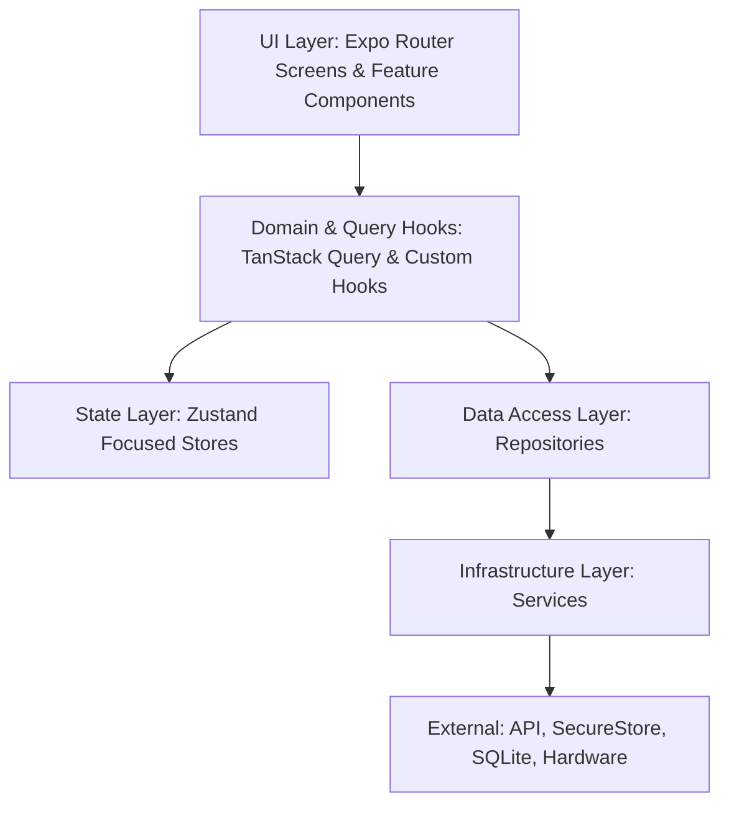

# TravelOS Engineering Handbook: System Architecture

This document describes the architectural layers, data flow patterns, and architectural boundaries governing the TravelOS codebase.

---

## 1. Architectural Layers

To ensure modularity and ease of maintainability as the application grows, TravelOS enforces a strict separation of concerns divided into four primary logical layers:

### I. UI Layer (`app/`, `components/`, `features/`)
* **Responsibility**: Rendering UI elements, responding to user actions, and displaying state.
* **Rules**: 
  - Components must be purely functional, theme-aware, and receive dynamic actions or state through standard React hooks.
  - No database queries, direct filesystem modifications, or native API calls should exist inside UI components.

### II. State & Hooks Layer (`store/`, `hooks/`)
* **Responsibility**: Exposing global client state (e.g., visual theme, auth token, local settings) and coordinating cached network/database reads.
* **Rules**:
  - Global client state is stored in focused, single-purpose Zustand stores.
  - Complex UI actions or async coordination live inside custom hooks or TanStack Query mutations to keep UI components free of complex side effects.

### III. Data Access Layer (Repositories) (`repositories/`)
* **Responsibility**: Providing a clean, domain-specific abstraction for data CRUD operations.
* **Rules**:
  - Repositories return pure typescript models (entities) and throw normalized domain errors.
  - Repositories decouple the UI from how the data is fetched (e.g., whether from a local mock, a SQLite database, or a REST API).
  - Repositories do not access React Context or Zustand directly.

### IV. Infrastructure Layer (Services) (`services/`)
* **Responsibility**: Direct wrappers around device features, Expo hardware APIs, local filesystems, or direct HTTP/WebSocket clients.
* **Rules**:
  - Services are low-level and stateless wherever possible.
  - They should throw descriptive, non-leaking errors.

---

## 2. Service vs. Repository Boundary

The separation between **Services** and **Repositories** is critical for testing and future migration (e.g., swapping mocks with server databases).

* **Example Scenario**: Location Data
  1. `LocationService` (Service): Call `expo-location` to retrieve latitude and longitude.
  2. `DestinationRepository` (Repository): Consumes coordinates from the location service and calls a mock database or API endpoint to query cities near those coordinates. It returns a list of typed `Destination` objects.
  3. `useNearDestinations` (Custom Hook): Wraps the repository call in TanStack Query for caching and loading state.
  4. `ExploreScreen` (UI Component): Consumes `useNearDestinations` and renders the list in a `FlashList`.

By keeping this boundary:
- We can write automated unit tests for `DestinationRepository` by mocking `LocationService`.
- If we change the backend API, we only update `DestinationRepository`; the UI components and custom hooks remain completely untouched.

---

## 3. State Management Best Practices

* **Use Focused Zustand Stores**: Avoid a monolithic `store.ts`. Create isolated stores such as `useAuthStore`, `useThemeStore`, and `useTripStore`.
* **State Selection**: Always use selector functions (e.g., `const user = useAuthStore(state => state.user)`) to avoid component re-renders when unrelated properties in the store change.
* **Persistence**: Persist onboarding, credentials, and settings using `expo-secure-store` or standard JSON storage wrappers within Zustand's middleware.
